```mermaid
graph TB
    subgraph "Frontend"
        A[Next.js 15 App Router] --> B[React Server Components]
        A --> C[Client Components]
        C --> D[shadcn/ui + Tailwind]
    end
    
    subgraph "Backend"
        E[API Routes] --> F[Server Actions]
        F --> G[WorkflowAI Service]
        F --> H[Spotify API Client]
    end
    
    subgraph "Database"
        I[Supabase PostgreSQL]
        I --> J[Row Level Security]
        I --> K[Real-time Subscriptions]
    end
    
    subgraph "External APIs"
        L[Spotify Web API]
        M[WorkflowAI]
    end
    
    A --> E
    E --> I
    F --> L
    F --> M
    
    style A fill:#000
    style I fill:#3ECF8E
    style L fill:#1DB954
    style M fill:#FF6B6B
```

# 🎵 Music Genie

<div align="center">

**Gerador de Playlists com Inteligência Artificial**

Uma aplicação web moderna que utiliza IA avançada para criar playlists personalizadas baseadas no seu gosto musical e salvá-las diretamente no Spotify.

[](https://nextjs.org/)
[](https://www.typescriptlang.org/)
[](https://supabase.com/)
[](https://spotify.com/)
[](https://vercel.com/)

[🌐 **Demo Online**](https://music-genie-seven.vercel.app) • [📖 **Documentação**](./docs/) • [🐛 **Reportar Bug**](https://github.com/optimisticloser/music-genie/issues) • [💡 **Sugerir Feature**](https://github.com/optimisticloser/music-genie/issues)

</div>

---

## 📋 Índice

- [🎯 Visão Geral](#-visão-geral)
- [✨ Funcionalidades](#-funcionalidades)
- [🏗️ Arquitetura](#️-arquitetura)
- [🛠️ Stack Tecnológica](#️-stack-tecnológica)
- [🚀 Quick Start](#-quick-start)
- [📁 Estrutura do Projeto](#-estrutura-do-projeto)
- [🔧 Desenvolvimento](#-desenvolvimento)
- [🚀 Deploy](#-deploy)
- [📊 Métricas e Performance](#-métricas-e-performance)
- [🤝 Contribuindo](#-contribuindo)
- [📄 Licença](#-licença)

---

## 🎯 Visão Geral

O **Music Genie** é uma aplicação web inovadora que combina **Inteligência Artificial** com **integração musical** para criar uma experiência única de descoberta de música. A plataforma permite que usuários criem playlists personalizadas usando prompts naturais ou seleções guiadas, e as salva diretamente em suas contas do Spotify.

### 🎨 Interface Híbrida
- **Seleções Guiadas**: Categorias predefinidas (Gênero, Humor, Época, Instrumentação)
- **Texto Livre**: Prompts criativos personalizados
- **Combinação Inteligente**: Mistura ambos os métodos para resultados únicos

### 🧠 IA Avançada
- **WorkflowAI Integration**: Processamento de linguagem natural avançado
- **Geração Contextual**: Playlists baseadas em contexto e preferências
- **Versionamento**: Múltiplas versões de uma mesma playlist

---

## ✨ Funcionalidades

### 🎵 **Geração de Playlists**
- ✅ Prompts naturais em linguagem humana
- ✅ Interface híbrida (guiada + texto livre)
- ✅ Geração baseada em IA com WorkflowAI
- ✅ Versionamento de playlists
- ✅ Histórico completo de gerações

### 🎧 **Integração Spotify**
- ✅ OAuth 2.0 com Spotify Web API
- ✅ Salvamento direto na conta do usuário
- ✅ Preview de áudio das músicas
- ✅ Capas de álbuns e metadados completos
- ✅ Busca e enriquecimento de dados

### 📱 **Interface & UX**
- ✅ Design responsivo (desktop + mobile)
- ✅ Componentes shadcn/ui + Tailwind CSS
- ✅ Loading states e feedback visual
- ✅ Sistema de favoritos
- ✅ Navegação intuitiva

### 🔐 **Autenticação & Segurança**
- ✅ Supabase Auth com OAuth
- ✅ Row Level Security (RLS)
- ✅ Tokens seguros e refresh automático
- ✅ Políticas de privacidade granulares

---

## 🏗️ Arquitetura



### 🔄 **Fluxo de Dados**

1. **Autenticação**: Supabase Auth + Spotify OAuth
2. **Geração**: Prompt → WorkflowAI → Spotify Search → Database
3. **Versionamento**: Playlist Lineage com histórico completo
4. **Sincronização**: Real-time updates via Supabase

---

## 🛠️ Stack Tecnológica

### **Frontend**
- **Framework**: [Next.js 15](https://nextjs.org/) com App Router
- **Linguagem**: [TypeScript](https://www.typescriptlang.org/)
- **Styling**: [Tailwind CSS](https://tailwindcss.com/) + [shadcn/ui](https://ui.shadcn.com/)
- **Animações**: [Framer Motion](https://www.framer.com/motion/)
- **Ícones**: [Lucide React](https://lucide.dev/)

### **Backend**
- **Runtime**: [Node.js](https://nodejs.org/) + Edge Runtime
- **API**: Next.js API Routes + Server Actions
- **Validação**: [Zod](https://zod.dev/)
- **ORM**: Supabase Client (tipado)

### **Banco de Dados**
- **Principal**: [Supabase](https://supabase.com/) (PostgreSQL)
- **Auth**: Supabase Auth com OAuth providers
- **Storage**: Supabase Storage (imagens de capa)
- **Real-time**: Supabase Realtime

### **Integrações**
- **Música**: [Spotify Web API](https://developer.spotify.com/documentation/web-api/)
- **IA**: [WorkflowAI](https://workflowai.com/) para processamento de linguagem natural
- **Deploy**: [Vercel](https://vercel.com/) com otimizações automáticas

### **Ferramentas de Desenvolvimento**
- **Linting**: [ESLint](https://eslint.org/) + [Prettier](https://prettier.io/)
- **Testing**: [tsx](https://github.com/esbuild-kit/tsx) para testes
- **Type Safety**: TypeScript strict mode
- **Git Hooks**: Husky (planejado)

---

## 🚀 Quick Start

### 📋 **Pré-requisitos**

- Node.js 18+ 
- npm ou yarn
- Conta no [Supabase](https://supabase.com)
- App no [Spotify Developer Dashboard](https://developer.spotify.com/dashboard)
- API Key do [WorkflowAI](https://workflowai.com) (opcional)

### 🔧 **Instalação**

```bash
# 1. Clone o repositório
git clone https://github.com/optimisticloser/music-genie.git
cd music-genie

# 2. Instale as dependências
npm install

# 3. Configure as variáveis de ambiente
cp .env.example .env.local
# Edite .env.local com suas credenciais

# 4. Execute as migrações do banco
# No dashboard do Supabase, execute:
# supabase/migrations/001_initial_schema.sql
# supabase/migrations/002_demo_prompts.sql

# 5. Inicie o servidor de desenvolvimento
npm run dev
```

Acesse [http://localhost:3000](http://localhost:3000) 🚀

### 🔑 **Configuração de Variáveis**

```env
# Supabase
NEXT_PUBLIC_SUPABASE_URL="https://your-project-ref.supabase.co"
NEXT_PUBLIC_SUPABASE_ANON_KEY="your-anon-key"
SUPABASE_SERVICE_ROLE_KEY="your-service-role-key"

# Spotify
SPOTIFY_CLIENT_ID="your-spotify-client-id"
SPOTIFY_CLIENT_SECRET="your-spotify-client-secret"
SPOTIFY_REDIRECT_URI="http://localhost:3000/api/auth/spotify/callback"

# WorkflowAI (opcional)
WORKFLOWAI_API_KEY="your-workflowai-api-key"
```

---

## 📁 Estrutura do Projeto

```
src/
├── app/                          # Next.js App Router
│   ├── api/                      # API Routes
│   │   ├── auth/spotify/         # OAuth callbacks
│   │   ├── playlist/             # Playlist operations
│   │   └── playlists/            # Playlist CRUD
│   ├── auth/                     # Páginas de autenticação
│   ├── dashboard/                # Interface principal
│   │   ├── generate/             # Gerador de playlists
│   │   ├── playlist/[id]/        # Visualização de playlist
│   │   └── settings/             # Configurações
│   └── layout.tsx                # Layout raiz
├── components/                   # Componentes React
│   ├── ui/                       # shadcn/ui components
│   ├── layout/                   # Layout components
│   ├── playlist/                 # Playlist-specific components
│   └── shared/                   # Shared components
├── features/                     # Feature modules
│   ├── auth/                     # Authentication logic
│   ├── playlist/                 # Playlist generation
│   └── settings/                 # User settings
├── hooks/                        # Custom React hooks
├── lib/                          # Utilities & services
│   ├── actions/                  # Server actions
│   ├── services/                 # External API clients
│   ├── supabase/                 # Database client
│   └── utils.ts                  # Helper functions
├── types/                        # TypeScript definitions
└── services/                     # Service layer
```

### 🎯 **Padrões de Arquitetura**

- **Domain-Driven Design**: Features organizadas por domínio
- **Server Components**: Renderização no servidor quando possível
- **Client Components**: Interatividade e estado local
- **Server Actions**: Mutations seguras e tipadas
- **API Routes**: Endpoints RESTful para operações complexas

---

## 🔧 Desenvolvimento

### 📝 **Scripts Disponíveis**

```bash
# Desenvolvimento
npm run dev          # Servidor de desenvolvimento com Turbopack
npm run build        # Build de produção
npm run start        # Servidor de produção
npm run lint         # ESLint + Prettier

# Testes
npm run test         # Executar testes
npm run test:watch   # Testes em modo watch
```

### 🎨 **Adicionando Componentes UI**

```bash
# Instalar componente do shadcn/ui
npx shadcn-ui@latest add button
npx shadcn-ui@latest add card
npx shadcn-ui@latest add dialog
```

### 🔄 **Convenções de Código**

- **TypeScript**: Strict mode ativado
- **Imports**: Absolute imports via `@/`
- **Naming**: PascalCase para componentes, camelCase para funções
- **File Structure**: Colocation de arquivos relacionados
- **Error Handling**: Try/catch com logs estruturados

---

## 🚀 Deploy

### ⚡ **Vercel (Recomendado)**

```bash
# 1. Conecte o repositório ao Vercel
# 2. Configure as variáveis de ambiente
# 3. Deploy automático a cada push

# Deploy manual (opcional)
npx vercel --prod
```

### 🌐 **Outras Plataformas**

O projeto é compatível com qualquer plataforma que suporte Next.js:

- **Netlify**: Build command: `npm run build`
- **Railway**: Deploy automático via Git
- **DigitalOcean**: App Platform
- **AWS**: Amplify ou EC2

### 🔧 **Configurações de Produção**

- ✅ Edge Runtime ativado para performance
- ✅ Image optimization automática
- ✅ Bundle analysis e otimização
- ✅ Error tracking (planejado: Sentry)
- ✅ Analytics (planejado: Vercel Analytics)

---

## 📊 Métricas e Performance

### ⚡ **Performance**

- **Lighthouse Score**: 95+ em todas as categorias
- **Core Web Vitals**: Otimizado
- **Bundle Size**: < 500KB gzipped
- **Time to Interactive**: < 2s

### 📈 **Funcionalidades**

- ✅ **Server-Side Rendering**: Páginas estáticas otimizadas
- ✅ **Image Optimization**: Next.js Image component
- ✅ **Code Splitting**: Lazy loading automático
- ✅ **Caching**: Supabase + Vercel Edge Cache
- ✅ **Real-time**: Supabase Realtime subscriptions

### 🔍 **Monitoramento**

- Console logs estruturados
- Error boundaries no frontend
- API route error handling
- Database query optimization

---

## 🤝 Contribuindo

Agradecemos seu interesse em contribuir com o Music Genie! 🎉

### 🚀 **Como Contribuir**

1. **Fork** o projeto no GitHub
2. **Crie uma branch** para sua feature:
   ```bash
   git checkout -b feature/amazing-feature
   ```
3. **Commit** suas mudanças:
   ```bash
   git commit -m 'feat: add amazing feature'
   ```
4. **Push** para a branch:
   ```bash
   git push origin feature/amazing-feature
   ```
5. **Abra um Pull Request** com descrição detalhada

### 📋 **Diretrizes**

- ✅ Mantenha o código limpo e bem documentado
- ✅ Siga os padrões de TypeScript e ESLint
- ✅ Teste suas mudanças antes de submeter
- ✅ Adicione testes quando apropriado
- ✅ Atualize a documentação se necessário

### 🐛 **Reportar Bugs**

Use o template de issue para bugs:
- Descrição clara do problema
- Passos para reproduzir
- Comportamento esperado vs atual
- Screenshots se aplicável

---

## 📄 Licença

Este projeto está sob a licença **MIT**. Veja o arquivo [LICENSE](LICENSE) para mais detalhes.

```
MIT License

Copyright (c) 2024 Music Genie Team

Permission is hereby granted, free of charge, to any person obtaining a copy
of this software and associated documentation files (the "Software"), to deal
in the Software without restriction, including without limitation the rights
to use, copy, modify, merge, publish, distribute, sublicense, and/or sell
copies of the Software, and to permit persons to whom the Software is
furnished to do so, subject to the following conditions:

The above copyright notice and this permission notice shall be included in all
copies or substantial portions of the Software.
```

---

## 🆘 Suporte

### 📞 **Canais de Ajuda**

- 🌐 **Website**: [music-genie-seven.vercel.app](https://music-genie-seven.vercel.app)
- 📧 **Email**: support@musicgenie.app
- 🐛 **Issues**: [GitHub Issues](https://github.com/optimisticloser/music-genie/issues)
- 📖 **Wiki**: [Documentação Completa](https://github.com/optimisticloser/music-genie/wiki)
- 💬 **Discord**: [Comunidade](https://discord.gg/musicgenie)

### 🔧 **Problemas Comuns**

| Problema | Solução |
|----------|---------|
| Erro de autenticação Spotify | Verificar redirect URIs no dashboard |
| Falha na conexão Supabase | Confirmar variáveis de ambiente |
| Playlist não salva | Verificar permissões OAuth |
| IA não responde | Confirmar WORKFLOWAI_API_KEY |

---

<div align="center">

## 🌟 Agradecimentos

**Spotify** pela API incrível • **Supabase** pela infraestrutura robusta • **WorkflowAI** pela tecnologia de IA • **Vercel** pela plataforma de deploy • **Comunidade open source** por todas as contribuições

---

**Feito com ❤️ pela equipe Music Genie**

*Transformando a forma como você descobre música através da inteligência artificial*

[⬆️ Voltar ao topo](#-music-genie)

</div>