# 🎵 Music Genie

<div align="center">

**AI-Powered Playlist Generator**

A modern web application that uses advanced AI to create personalized playlists based on your musical taste and save them directly to Spotify.

[](https://nextjs.org/)
[](https://www.typescriptlang.org/)
[](https://supabase.com/)
[](https://spotify.com/)
[](https://vercel.com/)

[🌐 **Live Demo**](https://music-genie-seven.vercel.app) • [📖 **Documentation**](./docs/) • [🐛 **Report Bug**](https://github.com/optimisticloser/music-genie/issues) • [💡 **Request Feature**](https://github.com/optimisticloser/music-genie/issues)

</div>

---

## 📋 Table of Contents

- [🎯 Overview](#-overview)
- [✨ Features](#-features)
- [🏗️ Architecture](#️-architecture)
- [🛠️ Tech Stack](#️-tech-stack)
- [🚀 Quick Start](#-quick-start)
- [📁 Project Structure](#-project-structure)
- [🔧 Development](#-development)
- [🚀 Deploy](#-deploy)
- [🤝 Contributing](#-contributing)
- [📄 License](#-license)

---

## 🎯 Overview

**Music Genie** is an innovative web application that combines **Artificial Intelligence** with **music integration** to create a unique music discovery experience. The platform allows users to create personalized playlists using natural prompts or guided selections, and saves them directly to their Spotify accounts.

### 🎨 Hybrid Interface
- **Guided Selections**: Predefined categories (Genre, Mood, Era, Instrumentation)
- **Free Text**: Custom creative prompts
- **Smart Combination**: Mixes both methods for unique results

### 🧠 Advanced AI
- **WorkflowAI Integration**: Advanced natural language processing
- **Contextual Generation**: Playlists based on context and preferences
- **Versioning**: Multiple versions of the same playlist

---

## ✨ Features

### 🎵 **Playlist Generation**
- ✅ Natural language prompts
- ✅ Hybrid interface (guided + free text)
- ✅ AI-based generation with WorkflowAI
- ✅ Playlist versioning
- ✅ Complete generation history

### 🎧 **Spotify Integration**
- ✅ OAuth 2.0 with Spotify Web API
- ✅ Direct saving to user account
- ✅ Audio preview of songs
- ✅ Album covers and complete metadata
- ✅ Search and data enrichment

### 📱 **Interface & UX**
- ✅ Responsive design (desktop + mobile)
- ✅ shadcn/ui + Tailwind CSS components
- ✅ Loading states and visual feedback
- ✅ Favorites system
- ✅ Intuitive navigation

### 🔐 **Authentication & Security**
- ✅ Supabase Auth with OAuth
- ✅ Row Level Security (RLS)
- ✅ Secure tokens and automatic refresh
- ✅ Granular privacy policies

---

## 🏗️ Architecture



```mermaid
graph TB
    subgraph "Frontend"
        A[Next.js 15 App Router] --> B[React Server Components]
        A --> C[Client Components]
        C --> D[shadcn/ui + Tailwind]
    end
    
    subgraph "Backend"
        E[API Routes] --> F[Server Actions]
        F --> G[WorkflowAI Service]
        F --> H[Spotify API Client]
    end
    
    subgraph "Database"
        I[Supabase PostgreSQL]
        I --> J[Row Level Security]
        I --> K[Real-time Subscriptions]
    end
    
    subgraph "External APIs"
        L[Spotify Web API]
        M[WorkflowAI]
    end
    
    A --> E
    E --> I
    F --> L
    F --> M
    
    style A fill:#000
    style I fill:#3ECF8E
    style L fill:#1DB954
    style M fill:#FF6B6B
```

### 🔄 **Data Flow**

1. **Authentication**: Supabase Auth + Spotify OAuth
2. **Generation**: Prompt → WorkflowAI → Spotify Search → Database
3. **Versioning**: Playlist Lineage with complete history
4. **Synchronization**: Real-time updates via Supabase

---

## 🛠️ Tech Stack

### **Frontend**
- **Framework**: [Next.js 15](https://nextjs.org/) with App Router
- **Language**: [TypeScript](https://www.typescriptlang.org/)
- **Styling**: [Tailwind CSS](https://tailwindcss.com/) + [shadcn/ui](https://ui.shadcn.com/)
- **Animations**: [Framer Motion](https://www.framer.com/motion/)
- **Icons**: [Lucide React](https://lucide.dev/)

### **Backend**
- **Runtime**: [Node.js](https://nodejs.org/) + Edge Runtime
- **API**: Next.js API Routes + Server Actions
- **Validation**: [Zod](https://zod.dev/)
- **ORM**: Typed Supabase Client

### **Database**
- **Main**: [Supabase](https://supabase.com/) (PostgreSQL)
- **Auth**: Supabase Auth with OAuth providers
- **Storage**: Supabase Storage (cover images)
- **Real-time**: Supabase Realtime

### **Integrations**
- **Music**: [Spotify Web API](https://developer.spotify.com/documentation/web-api/)
- **AI**: [WorkflowAI](https://workflowai.com/) for natural language processing
- **Deploy**: [Vercel](https://vercel.com/) with automatic optimizations

### **Development Tools**
- **Linting**: [ESLint](https://eslint.org/) + [Prettier](https://prettier.io/)
- **Testing**: [tsx](https://github.com/esbuild-kit/tsx) for tests
- **Type Safety**: TypeScript strict mode
- **Git Hooks**: Husky (planned)

---

## 🚀 Quick Start

### 📋 **Prerequisites**

- Node.js 18+ 
- npm or yarn
- [Supabase](https://supabase.com) account
- App in [Spotify Developer Dashboard](https://developer.spotify.com/dashboard)
- [WorkflowAI](https://workflowai.com) API Key (optional)

### 🔧 **Installation**

```bash
# 1. Clone the repository
git clone https://github.com/optimisticloser/music-genie.git
cd music-genie

# 2. Install dependencies
npm install

# 3. Configure environment variables
cp .env.example .env.local
# Edit .env.local with your credentials

# 4. Run database migrations
# In the Supabase dashboard, execute:
# supabase/migrations/001_initial_schema.sql
# supabase/migrations/002_demo_prompts.sql

# 5. Start the development server
npm run dev
```

Visit [http://localhost:3000](http://localhost:3000) 🚀

### 🔑 **Environment Variables**

```env
# Supabase
NEXT_PUBLIC_SUPABASE_URL="https://your-project-ref.supabase.co"
NEXT_PUBLIC_SUPABASE_ANON_KEY="your-anon-key"
SUPABASE_SERVICE_ROLE_KEY="your-service-role-key"

# Spotify
SPOTIFY_CLIENT_ID="your-spotify-client-id"
SPOTIFY_CLIENT_SECRET="your-spotify-client-secret"
SPOTIFY_REDIRECT_URI="http://localhost:3000/api/auth/spotify/callback"

# WorkflowAI (optional)
WORKFLOWAI_API_KEY="your-workflowai-api-key"
```

---

## 📁 Project Structure

```
src/
├── app/                          # Next.js App Router
│   ├── api/                      # API Routes
│   │   ├── auth/spotify/         # OAuth callbacks
│   │   ├── playlist/             # Playlist operations
│   │   └── playlists/            # Playlist CRUD
│   ├── auth/                     # Authentication pages
│   ├── dashboard/                # Main interface
│   │   ├── generate/             # Playlist generator
│   │   ├── playlist/[id]/        # Playlist view
│   │   └── settings/             # Settings
│   └── layout.tsx                # Root layout
├── components/                   # React components
│   ├── ui/                       # shadcn/ui components
│   ├── layout/                   # Layout components
│   ├── playlist/                 # Playlist-specific components
│   └── shared/                   # Shared components
├── features/                     # Feature modules
│   ├── auth/                     # Authentication logic
│   ├── playlist/                 # Playlist generation
│   └── settings/                 # User settings
├── hooks/                        # Custom React hooks
├── lib/                          # Utilities & services
│   ├── actions/                  # Server actions
│   ├── services/                 # External API clients
│   ├── supabase/                 # Database client
│   └── utils.ts                  # Helper functions
├── types/                        # TypeScript definitions
└── services/                     # Service layer
```

### 🎯 **Architecture Patterns**

- **Domain-Driven Design**: Features organized by domain
- **Server Components**: Server-side rendering when possible
- **Client Components**: Interactivity and local state
- **Server Actions**: Secure and typed mutations
- **API Routes**: RESTful endpoints for complex operations

---

## 🔧 Development

### 📝 **Available Scripts**

```bash
# Development
npm run dev          # Development server with Turbopack
npm run build        # Production build
npm run start        # Production server
npm run lint         # ESLint + Prettier

# Testing
npm run test         # Run tests
npm run test:watch   # Tests in watch mode
```

### 🎨 **Adding UI Components**

```bash
# Install shadcn/ui component
npx shadcn-ui@latest add button
npx shadcn-ui@latest add card
npx shadcn-ui@latest add dialog
```

### 🔄 **Code Conventions**

- **TypeScript**: Strict mode enabled
- **Imports**: Absolute imports via `@/`
- **Naming**: PascalCase for components, camelCase for functions
- **File Structure**: Colocation of related files
- **Error Handling**: Try/catch with structured logs

---

## 🚀 Deploy

### ⚡ **Vercel (Recommended)**

```bash
# 1. Connect repository to Vercel
# 2. Configure environment variables
# 3. Automatic deploy on every push

# Manual deploy (optional)
npx vercel --prod
```

### 🌐 **Other Platforms**

The project is compatible with any platform that supports Next.js:

- **Netlify**: Build command: `npm run build`
- **Railway**: Automatic deploy via Git
- **DigitalOcean**: App Platform
- **AWS**: Amplify or EC2

### 🔧 **Production Settings**

- ✅ Edge Runtime enabled for performance
- ✅ Automatic image optimization
- ✅ Bundle analysis and optimization
- ✅ Error tracking (planned: Sentry)
- ✅ Analytics (planned: Vercel Analytics)

---

## 🤝 Contributing

We appreciate your interest in contributing to Music Genie! 🎉

### 🚀 **How to Contribute**

1. **Fork** the project on GitHub
2. **Create a branch** for your feature:
   ```bash
   git checkout -b feature/amazing-feature
   ```
3. **Commit** your changes:
   ```bash
   git commit -m 'feat: add amazing feature'
   ```
4. **Push** to the branch:
   ```bash
   git push origin feature/amazing-feature
   ```
5. **Open a Pull Request** with detailed description

### 📋 **Guidelines**

- ✅ Keep code clean and well documented
- ✅ Follow TypeScript and ESLint standards
- ✅ Test your changes before submitting
- ✅ Add tests when appropriate
- ✅ Update documentation if necessary

### 🐛 **Reporting Bugs**

Use the issue template for bugs:
- Clear problem description
- Steps to reproduce
- Expected vs actual behavior
- Screenshots if applicable

---

## 📄 License

This project is licensed under the **MIT License**. See the [LICENSE](LICENSE) file for more details.

```
MIT License

Copyright (c) 2024 Music Genie Team

Permission is hereby granted, free of charge, to any person obtaining a copy
of this software and associated documentation files (the "Software"), to deal
in the Software without restriction, including without limitation the rights
to use, copy, modify, merge, publish, distribute, sublicense, and/or sell
copies of the Software, and to permit persons to whom the Software is
furnished to do so, subject to the following conditions:

The above copyright notice and this permission notice shall be included in all
copies or substantial portions of the Software.
```

---

<div align="center">

## 🌟 Acknowledgments

**Spotify** for the amazing API • **Supabase** for the robust infrastructure • **WorkflowAI** for the AI technology • **Vercel** for the deployment platform • **Open source community** for all contributions

---

**Made with ❤️ by Sergio Fernandes**

*Transforming how you discover music through artificial intelligence*

[⬆️ Back to top](#-music-genie)

</div>