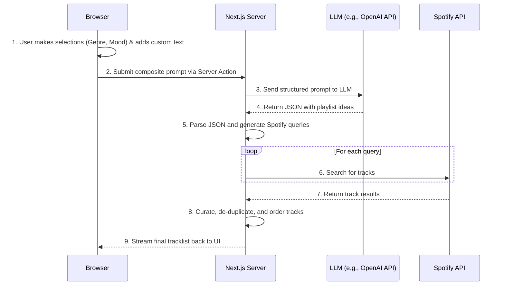

# AI Implementation: The Hybrid Prompt Generator

> Last updated: 2024-06-12

This document provides a detailed technical breakdown of the AI-powered playlist generator. It is based on the hybrid prompt construction model from the original Swift application, combining guided, structured selections with free-form user text.

---

## 1. System Architecture

The core logic remains the same, but the initial prompt construction is more sophisticated.



---

## 2. Hybrid Prompt Construction

Instead of a single text box, the UI provides a guided experience, mirroring the `PromptBuilderView` in the iOS app. The final prompt is a combination of two user input types.

### 2.1. Guided Selections (The "Modifiers")

-   The UI presents users with several categories (or "modifiers") like **Genre**, **Mood**, **Era**, and **Instrumentation**.
-   Each category contains a hierarchy of selectable nodes (e.g., Genre → Rock → 90s Alternative).
-   On the web, this could be implemented as a series of dropdowns, a collapsible tree view, or interactive buttons.
-   The selected nodes are collected as structured data and also displayed as chips in the UI.

### 2.2. Custom Text Input

-   An additional text field allows users to add their own creative text (e.g., "for a rainy day," "songs that sound like a Wes Anderson movie").
-   When the user submits the text, it becomes a removable "chip" in the UI, just like the guided selections.

### 2.3. Final Prompt Assembly

The selections and custom text chips are combined into a single, comma-separated string that is sent to the AI.

-   **Example:**
    -   User selects Genre: `Indie Folk`
    -   User selects Mood: `Mellow`
    -   User adds custom text: `for studying`
    -   **Final Assembled Prompt**: `Create a playlist with Indie Folk, Mellow, for studying`

This assembled prompt is then injected into the System Prompt.

---

## 3. Prompt Engineering (Revised)

The system prompt is now engineered to deconstruct this "tag-based" input.

**Example System Prompt:**
```
You are Music Genie, an expert DJ. Your task is to interpret a user's comma-separated list of musical attributes and translate it into a structured list of search queries for Spotify.

**Rules:**
1.  You MUST respond with a valid JSON object with three keys: `title`, `description`, and `queries`.
2.  The `queries` array should contain 5-10 distinct, specific strings optimized for Spotify search.
3.  Synthesize all the user's tags. If they ask for "80s" and "sad", suggest queries for "sad 80s new wave" or "80s synth-pop ballads".
4.  Think creatively. Combine genres, moods, and eras. For example, for "rock, upbeat, 70s", you could suggest "glam rock anthems", "70s power pop", or "classic rock with high energy".
5.  Do not suggest specific track names. Focus on descriptive queries that will yield a good variety of songs.

**User Request:**
{{ASSEMBLED_PROMPT_HERE}}
```

-   **User Request:** `Indie Folk, Mellow, for studying`
-   **LLM Expected Output (JSON):**
    ```json
    {
      "title": "Acoustic Study Session",
      "description": "Mellow indie folk to help you focus. Gentle guitars and soft vocals for late-night productivity.",
      "queries": [
        "acoustic concentration",
        "mellow indie folk playlist",
        "artists like Bon Iver",
        "chill study music",
        "instrumental folk for reading",
        "coffeehouse indie"
      ]
    }
    ```

---

## 4. The AI-to-Spotify Bridge & Curation

The process for handling the LLM's JSON response (parsing, searching Spotify, curating, and de-duplicating) remains the same as previously outlined. The key difference is the more structured and reliable input, which should lead to higher-quality, more relevant search queries from the AI.

---

## 5. Future Enhancements

-   **Weighted Modifiers:** Allow the AI to treat certain user selections as more important. The original `selectedNodes` data structure could be passed to the backend for this purpose.
-   **"Surprise Me" Feature:** A button that pre-populates the guided selections with a random, interesting combination.
-   **Dynamic Modifiers:** The AI could suggest follow-up modifiers based on initial selections. If a user picks "Hip Hop," the UI could dynamically show a new "Subgenre" modifier with options like "Trap," "Boom Bap," etc. 